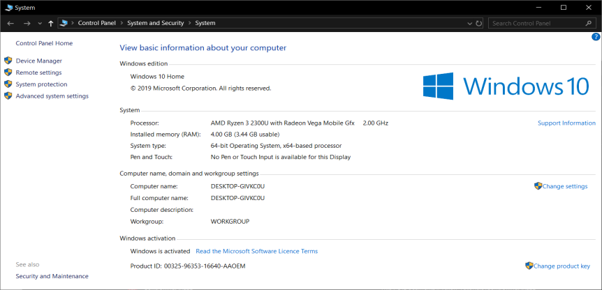

# Installing Mu

Mu is a simple code editor developed in Python for Python. Mu has built-in support for Adafruit Circuit Playground Express, micro:bit, PyGame and Python. Mu runs on Windows, Mac, Linux and even the Raspberry Pi.

[Installing on Windows](#installing-mu-on-windows)
[Installing on Linux](#installing-mu-on-linux)
[Installing on Raspberry Pi](#installing-mu-on-raspbian)

## Installing Mu On Windows

1. Go to [codewith.mu](https://codewith.mu/)
2. Click on Download
3. Under Windows Installer click on either **32 bit** or **64 bit** depending on the Operating System you are running.
   To find out what version of Windows you are running follow these instructions:
   1. Open Explorer
   2. Right click on this PC
   3. Click on properties. Under system type it will say either **32 bit** or **64 bit** 
     

4. Once the installer has downloaded. Locate where the file was downloaded to (normally your Downloads folder)
5. Double click on the file to run the installer
6. Follow the instructions on screen

You have now got Mu installed on your computer Happy Coding.

## Installing Mu On Linux

Each Linux distro is a bit different, so for this guide, I am going to focus on Ubuntu.

1. Open up a Terminal window.
2. Mu requires Python3. You can check and see if you have Python3 installed by typing ```python3 --version``` If nothing is displayed type ```sudo apt install python3```to install Python3.
3. You also need pip3 installed type ```pip3 --version``` If it shows nothing you need to install pip3 by typing ```sudo apt install python3-pip```
4. Finally to install Mu type ```pip3 install mu_editor```
5. You can now run Mu from the command line by typing ```Mu```

Now that you have Mu installed you can go and develop in Python3, MicroPython for micro:bit or even CircuitPython for the Adafruit Circuit Playground Express.

## Installing Mu On Raspbian

If you are running the latest version of Raspbian (Buster) Mu is in the recommended software menu.

1. Click on the Raspberry in the top left corner to open the menu
2. Hover over preferences
3. Click on Recommended Software
4. Click on Programming
5. Click on Mu and then click on OK.

If Mu isn't already under the Recommended Software update your Raspberry Pi by following these steps:

1. Open a terminal by clicking on the black square on the menu bar at the top
2. Type ```sudo apt update``` and press enter
3. Type ```sudo apt dist-upgrade``` and press enter
4. Once this has complete follow the instructions above to install Mu

Well done you now have Mu installed you can now write some Python code.