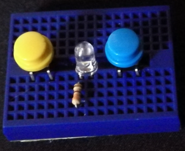

# On The Road To MozFest 2017

This is going to be a weekly diary leading up to MozFest 2017.

## Week 1: 01.10.17 - 07.10.17

Throughout this week I have completed my blog post which can be found here [I'm Going to MozFest 2017](http://www.raspikidd.com/i-going-mozfest-2017) This is something every facilitator at MozFest is asked to do.

I have also started writing the Quick Reaction Game worksheet and trying out the code to make sure everything works. This involved creating the electronic circuit  with an Electronic breadboard, an LED, 2 x push buttons, a resistor and Male to Female jumper wires to connect the components to the Raspberry Pi.

So far everything is going to plan.

Throughout the next week I will be adding more functionality to the worksheet by adding user input. Once this is done the worksheet will be complete.

The next steps are to create the presentation and read the worksheet over and make necessary changes.

Come back next week for the Next update.

## Week 2: 08.10.17 - 14.10.17
Well within the last week I have finished the first draft of the worksheet and sent it off to wranglers to be checked over and see what they think.

I have also started my presentation for MozFest which explains what the electronic components are and how we are going to use them within the session.

We are now going into the final 2 weeks before MozFest so lots of deadlines coming up. I need to have the worksheet approved and completed for Friday the 20th, so they can go and get printed in time for the festival. There is a video call for facilitators on the 22nd.  

That is all for this week Come back next week for the next update.

## Week 3: 15.10.17 - 21.10.17
Well this week has seen a fairly busy week by making sure I have enough electronics for creating the quick reaction game kits, getting RaspiKidd t-shirt printed ready for MozFest. I have also been working on the presentation for my session which has to be complete by Monday the 23rd. I am just waiting to see if the PiZero EduBlocks problems are solved before the deadline. If not rather than following my plan of live coding the Quick reaction game with the participants I will just be adding the code into the presentation.

The reason I was going to use a PiZero for the coding is that I can have it plugged into my computer through USB and have the PiZero act as an on the the go Ethernet device. Basically I can log into the PiZero through VNC viewer using raspberry pi.local rather than having to find out what the IP address is. Also the PiZero can share the laptop internet connection. It’s always good to have a plan B and maybe even a plan C.

Again this has not been a very short update. Next week is the week leading up to MozFest. I will probably write a quick update on the week while travelling to London on the train on Thursday. I have not decided how I’m going to blog about the weekend yet. My options are trying to find time at the end of everyday and do a round up after or do a longer post after the weekend. (probably on the train back to Scotland lol) If you guys have a preference for this I would love to hear them in the comments.

As well as blogging about the whole festival I will also do a post on how well I think my session went.

That’s all for this week. Come back next week for the final part of the Road To MozFest.

## Week 4: 22.10.17 - 26.10.17
So this week I have received the final info I need for the festival. I have also completed the session presentation and prepared 10 kits for the session, plus extra components incase some of the components decide not to work on the day. (it is better being over prepared than underprepared)

Even as I am travelling on the train and writing this post I have found another good piece of info to add into my presentation about LEDs. 

I am very excited to meet everyone Tomorrow (Friday), but also getting nervous about running a session within a festival of this size, but also psyched about doing it.

This is a very short post again, but be prepared for a long post at the start of next week loaded with lots of pictures.

Thanks for keeping with me through this series of blog posts. Hope to maybe even see some of you at MozFest 2017!
