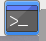
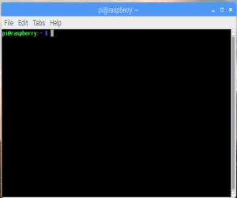
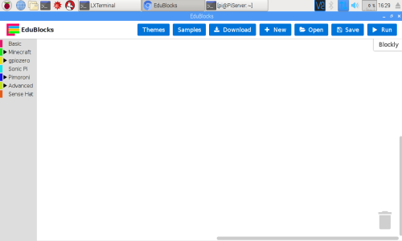
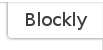
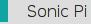
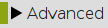

# Getting Started

## What Is EduBlocks?
Edublocks is a new program for the raspberry pi, which allows you to write real python code but in block format like Scratch, with this in mind it is helping educators teach younger children to program in python and by the time they are able to move on to
python they will already understand the python syntax.

## How To Install EduBlocks
EduBlocks does not come installed on the Raspberry Pi by default, so for us to install it we need to open a terminal window do this by clicking on the icon that looks like this  It is located at the top along from the menu icon.

Once the Terminal has opened you will see a window similar to this: 

Now we need to type the following command:

```
curl -sSL get.edublocks.org | bash
```
Once you have typed the line above press enter. Now we just have to wait till its finished.

## Getting To Know EduBlocks
Once it is finished you will see that there is an EduBlocks Icon on the desktop, like this:  Double click on the icon.

Once Edublocks has loaded you will see something like this: 

The menu along the top gives you options of what to do with your code.

*  The themes option gives you the choice of different themes for EduBlocks for example MineCraft.

*  By clicking on this tab you can get some sample code written in EduBlocks.

*  This lets you download your Edublocks code file as Python and save it to your Raspberry Pi.

*  This opens a new blank EduBlocks canvas.

*  This opens previously saved EduBlocks code.

*  This saves EduBlocks code for you to go back to later.

*  This runs any code that you have created.

Just below this menu you will see a tab  like this  by clicking on it you can swap between blocly view and Python view.

The menu down the left hand side gives you your coding blocks.

*  The basics menu has things that may be used a lot like while loops and print statements.

*  Clicking on Minecraft gives you 2 sub menus.

 *  This contains the blocks to interact with the python Library and the Minecraft program.

 *  This contains the rest of the blocks needed to integrate with Minecraft like the post to chat. which posts messages to the chat menu in Minecraft.

*  This is the Python GPIO zero library. It is split into 5 sub-menus.

  *  This contains general blocks of code to import libraries.

  *  This displays 5 sub-menus, 1 for each type of input devices that the GPIOZero library supports for example, Buttons and Line follower.

  *  This displays 7 sub-menus 1 for each type of output devices that the GPIOZero Library supports for example, LED and Motor.

  * 
*  this allows you to interact with the sonic pi program which allows you to live code music.

*  This is a menu of Pimoroni add on boards that can be controlled using EduBlocks.

*  This contains advanced Edublock commands.

That is all I am going to cover in this guide.

### Keep having FUN while LEARNING!  
