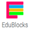

# Getting Started

## What Is EduBlocks?
Edublocks is a new program for the raspberry pi, which allows you to write real python code but in block format like Scratch, with this in mind it is helping educators teach younger children to program in python and by the time they are able to move on to
python they will already understand the python syntax.

## How To Install EduBlocks
EduBlocks does not come installed on the Raspberry Pi by default, so for us to install it we need to open a terminal window do this by clicking on the icon that looks like this  It is located at the top along from the menu icon.

Once the Terminal has opened you will see a window similar to this: 

Now we need to type the following command:

```
curl -sSL get.edublocks.org | bash
```
Once you have typed the line above press enter. Now we just have to wait till its finished.

## Getting To Know EduBlocks
Once it is finished you will see that there is an EduBlocks Icon on the desktop, like this:  Double click on the icon.

Once Edublocks has loaded you will see something like this: 

The menu along the top gives you options of what to do with your code.

*  is the default view.

*  This lets you see your code written as python.

*  This Downloads your code as Python.

*  This opens previously saved EduBlocks code.

*  This saves EduBlocks code for you to go back to later.

*  This runs any code that you have created.

The menu down the left hand side gives you your coding blocks.

*  The basics menu has things that may be used a lot like while loops and print statements.

*  The EduPy menu gives you 3 sub menus. These refer to the CamJam EduKits, which is what EduPy was developed for.

 *  This lets you control basic electronics like LEDs, buttons, and buzzers.

 *  This lets you control sensors like Temperature and motion.

 *  This lets you to control robots.

*  Clicking on Minecraft gives you 2 sub menus.

 *  This contains the blocks to interact with the python Library and the Minecraft program.

 *  This contains the rest of the blocks needed to integrate with Minecraft like the post to chat. which posts messages to the chat menu in Minecraft.

*  this allows you to interact with the sonic pi program which allows you to live code music.

*  This is a menu of Pimoroni add on boards that can be controlled using EduBlocks.

*  This contains advanced Edublock commands.

That is all I am going to cover in this guide.

### Keep having FUN while LEARNING!  
