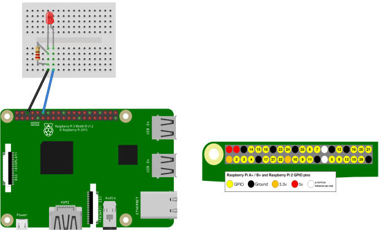
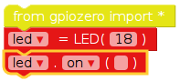

# Turning An LED On
Within this tutorial we are going to turn an LED on using EduBlocks and a Raspberry Pi.

## Equipment You Will Need

* 1 x  LED
* 2 x male to female jumper wires
* 1 x breadboard
* 1 x 330 ohm resistor
* Raspberry Pi
* keyboard
* Mouse
* SD Card with Raspbian installed
* HDMI cable
* Compatible Screen
* Power Supply

## The Circuit
Lets build the circuit. Make sure you have your LED the right way round. The positive leg is the longer leg on the LED, this is represented by the bent leg in the diagram below:

## Code
The fist thing we need to do is open EduBlocks. do this by double clicking on the  desktop icon.

1. Click on the  and click on the  and locate the  and drag it to the coding area.

2. Next Click on the  menu. Then click on the  From here locate the  and drag it to the coding area and attach it under the . where it says pin change that to say *18*.

3. Next locate the  and attach it under the 

Your code should now look like this:

## Running Your Code
To run your code click on  in the top far right corner.

You should now see your LED turn on.

### Keep having FUN while LEARNING!
