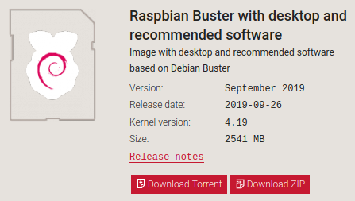
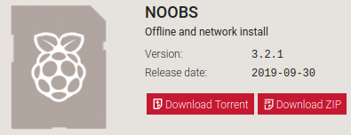
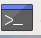

# Setting Up a Raspberry Pi

Within this guide I am going to take you through setting up the Raspberry Pi software.

There are two common ways to install Raspbian ( the default Raspberry Pi software) The first way is through NOOBS and the second is through the Raspbian link.

Click on the links below to the relevant guide.
1. [Raspbian](#raspbian)
2. [NOOBS](#noobs) 

## Raspbian

This part of the guide will take you through downloading, installing and Setting up Raspbian.

### Downloading Raspbian

1. Go to the Raspberry Pi website [raspberrypi.org](https://www.raspberrypi.org/downloads/)
2. Click on Raspbian
3. Click on Download ZIP (see image below)
   
4.  

## NOOBS

This part of the guide will take you through downloading and installing NOOBS (New Out Of the Box Software)

### Downloading NOOBS

1. Go to the Raspberry Pi website [raspberrypi.org](https://www.raspberrypi.org/downloads/)
2. Click on NOOBS
3. Click on Download ZIP under NOOBS (see image below)
   
4. While NOOBS is downloading insert the microSD card into the computer and format it. Do this by right clicking on the removable drive and click format 
5. Once NOOBS has finished downloading navigate to the folder where it was downloaded
6. Right click on the folder and click extract
7. Once NOOBS has finished extracting double click on the folder to open it and copy the files that are inside. Do this by pressing ctrl + A on the keyboard.
8. Click on the microSD card removable drive and press ctrl + V to paste the files onto the drive
9. Once the files have finished copying to the microSD card. Safely remove it from the computer. 

Now it's time to move over to the Raspberry Pi.

### Starting NOOBS and Installing Raspbian

1. Insert the microSD card into the Raspberry Pi and plug the Raspberry Pi in
2. Once the Raspberry Pi has started up, click on Wifi networks at the top and connect to your WiFi network
3. Click on Raspbian Full [RECOMMENDED]
4. Click on Install at the top
5. A warning message will appear telling you the microSD card will be over written with the operating System and all other data will be wiped.

Now we wait till the Operating System is installed.

Once Raspbian is installed a pop-up will appear on screen Click ok.

### Setting up Raspbian

1. Click Next
2. Pick your Country, Language and Timezone, then click Next
3. Set a password and click Next
4. Set up your screen, if you see a black border around the desktop click the white box. If not click Next
5. Set up your Wifi network (if you did this right at the start) click Skip
6. Click Next to check for updates and install them

Once the Raspberry Pi has updated a prompt will appear on screen asking you to reboot. Click on reboot.

**NOTE:** You may get a pop-up saying updates failed. Don't worry we will up date it after reboot. So for now follow the instructions on screen. Click ok and click Restart.

Once your Raspberry Pi has rebooted you are good to go!

## Updating the Raspberry Pi
As promised we will now cover how to update your Raspberry Pi.

1. Click on the icon at the top of the screen that looks like this  A black screen will appear the this is known as the terminal
2. type the following command
   ```
   sudo apt update
   ```
   This will check for updates
3. Type the following command
   ```
   sudo apt upgrade
   ```
   This will prompt you tellling you you are going to apply updates press **Y** on the keyboard and press **enter**

Follow any other prompts that may appear.

Theses are useful commands to know since it is the only way to update your Raspberry Pi and it's software.

#### Well Done you have successfully Downloaded, Installed and Updated your Raspberry Pi. 