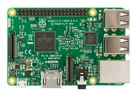

RaspiKidd is to help anyone who wants to learn how to program, whether you are young or old why not have a go. I specifically teach people how to code using Raspberry Pi’s partly because they are so affordable and partly because you can link them to the outside world through the GPIO (*General Purpose Input Output*) pins, which can be used to turn LED’s(*Light Emitting Diode*) on and off or integrated into robotics. You can even learn how to program using MineCraft.

I aim to teach anyone that wants to learn. Whether you are unemployed and looking to gain new skills or a parent who has kids that love to code why not come along and learn with them.

## What is a Raspberry Pi?
A Raspberry pi is a small but powerful credit card sized computer that retails between £25-£35 and is manufactured within the UK. (see image above)  
