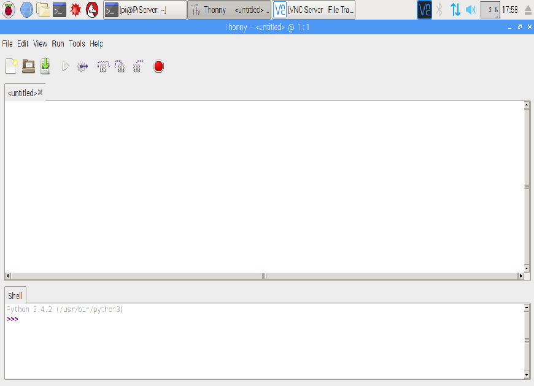

within this tutorial we are going to turn an LED on using a raspberry pi and python.

## Equipment You Will Need
* 1 x red LED
* 2 x male to female jumper wires
* 1 x breadboard
* 1 x 330 ohm resistor
* Raspberry Pi
* keyboard
* Mouse
* SD Card with Raspbian installed
* HDMI cable
* Compatible Screen
* Power Supply

## Making The Circuit
Lets build the circuit. Make sure you have your LED the right way round. The positive leg is the longer leg on the LED, this is represented by the bent leg in the diagram below:


Now that we have created the circuit, we can turn the raspberry pi on and get coding.

## Code
Our raspberry pi is all booted up so we are now ready to code. To open python go to menu -> programming and click on Thonny python IDE.  Once Thonny has opened you will get a window similar to this  We can now create our program by typing the text below into the top half of the window. You can ignore the text after # as this is a comment in python which is telling you what the code does.

```python
import gpiozero # importing the gpiozero python library. This is how python talks to the raspberry pi GPIO pins
from gpiozero import LED # this imports the LED module from the gpiozero library
led = LED(18) # This is declaring pin 18 as the LED
led.on() # This is turning the LED on
```

## Running The Code
Before we can run the code we need to save it. To do this go to file -> save as and name the program LedOn.py and press enter on the keyboard or click OK with the mouse. Now we can run our code, to do this click on the  above the coding area. You should now see your LED turn on. If your LED has not turned on make sure your circuit is wired correctly and that you have typed the code correctly.


### Keep having FUN while LEARNING!
