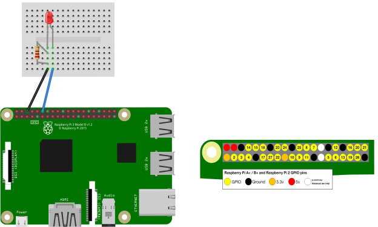
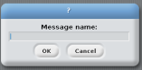
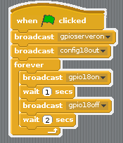

# Blinking LED

Within this tutorial we are going to use Scratch and a Raspberry Pi to make an LED blink on and off.

## Equipment You Will Need
* 1 x red LED
* 2 x male to female jumper wires
* 1 x breadboard
* 1 x 330 ohm resistor
* Raspberry Pi
* keyboard
* Mouse
* SD Card with Raspbian installed
* HDMI cable
* Compatible Screen
* Power Supply

## The Circuit

## Code
The first thing we need to do is load scratch. To do this go to menu -> programming -> scratch.

1. Once Scratch has opened click on the 

2. Drag a  block to the coding area.

3. Next we need a  block. Connect it to the  block.

4. Now click on the little black arrow and click the next/edit button. You should get a text box like this . In the textbox type *gpioserveron* and click OK.

5. Drag another  block into the coding area and attach it to the  block. Click on the black arrow and click on new/edit. This time type *config18out* and click OK.

6. Next we need a  block. Attach this under the  block.

7. We now need another  block this time attach it within the  block. Again click on the black arrow and edit/new. This time type *gpio18on*.

8. We now need a  block. Attach this under the  block.

9. Next we need another  block. Attach this under the  block. Click on the black arrow and edit/new within the text box type *gpio18off*.

10. we now need another  block and attach it under the  block. Click within the white space and change the 1 to a 2.

Your code should look like this 

## What The Code Does
*  This tells Scratch to run the code when the green flag is clicked.

*  This tells Scratch to interact with the GPIO pins on the pi.

*  This configures pin 18 on the raspberry pi as an output.

* . This makes the code loop forever.

*  This tells the raspberry pi to turn GPIO pin 18 on, which is where your LED is attached.

*  This makes the code pause for 1 second.

*  This tells the raspberry pi to turn GPIO pin 18 off, which is where your LED is attached.

*  This makes the code pause for 2 seconds.

## Running The Code
Now that we have finished the code to run it click . You should now see the LED blink on and off, if you don't go back and see where you went wrong.

To stop the code click on the 

Well done you have just made an LED blink on and off.

### Keep Having FUN while LEARNING!
