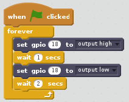

# Blinking LED

Within this tutorial we are going to use Scratch and a Raspberry Pi to make an LED blink on and off.

## Equipment You Will Need
* 1 x red LED
* 2 x male to female jumper wires
* 1 x breadboard
* 1 x 330 ohm resistor
* Raspberry Pi
* keyboard
* Mouse
* SD Card with Raspbian installed
* HDMI cable
* Compatible Screen
* Power Supply

## The Circuit
Lets build the circuit. Make sure you have your LED the right way round. The positive leg is the longer leg on the LED, this is represented by the bent leg in the diagram below:

## Code
The first thing we need to do is load scratch. To do this go to menu -> programming -> scratch.

1. Once Scratch has opened click on the 

2. Drag a  block to the coding area.

3. Next we need to go to the  and drag  a  block. Attach this under the  block.

4. We now need to go to the  menu.

5. We now need to click on . Then double click  extension.

6. Next we need a  block. Attach this in the  block. Click in the white circle and type *18*.

7. we now need to go back to the  and drag a   block and attach it under the  block.

8. We now need to go back to the  menu and get another  and attach it under the  block. Again click in the circle and type *18* then click on the black arrow and select *output low*.

9. Again go back to the  and drag another  block and attach it under the  and click in the box that says 1 and change it to *2*.

Your code should look like this 

## What The Code Does
*  This tells Scratch to run the code when the green flag is clicked.

* . This makes the code loop forever.

*  This tells the raspberry pi to turn GPIO pin 18 on, which is where your LED is attached.

*  This makes the code pause for 1 second.

*  This tells the raspberry pi to turn GPIO pin 18 off, which is where your LED is attached.

*  This makes the code pause for 2 seconds.

## Running The Code
Now that we have finished the code to run it click . You should now see the LED blink on and off, if you don't go back and see where you went wrong.

To stop the code click on the 

Well done you have just made an LED blink on and off.

### Keep Having FUN while LEARNING!
