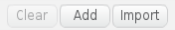

# Getting Started with Scratch 2
Scratch is an interactive programming language that lets you create animations, games, sounds, graphics and animated stories.

To start the scratch program go to menu -> programming -> scratch.

## What You Will Need
* Raspberry Pi
* HDMI cable
* Mouse
* Keyboard
* Speaker/Headphones
* SD Card With the Raspbian Operating System installed
* Compatible Screen
* Power Supply

## Making Felix Move
Make sure that you are in the  menu on the left hand side. Drag the  block into the coding area on the right.

Click on the block to make Felix move.

Well done you have programmed Felix the cat to move 10 steps.

## Lets Add Sound
Click on the  menu on the left. Drag the  and attach it to the  your code should now look like this 

Click on the blocks and listen.

You can experiment by clicking on the dropdown arrow and selecting a different drum sound.

## Make Felix Dance
Go back to the  menu. Drag another  block and attach it underneath the  block. Click at the start of the 10 and add a minus (-) sign. Your code should now look like this 

Click on the block of code and see what happens.

Go back to the  menu and add another  block and attach it to the very bottom of your code block and pick a different drum sound. Your code should now look like this 

Click on the block of code to run it.

## Making The Code Repeat
Click on the  menu. Drag a  block and drop it at the top of your code making it wrap around all the other blocks like this 

Click on the block of code to run it. You should see the code run 10 times then stop.

## Make Felix Talk
Click on the  menu. Click and drag a  block and place it below the repeat block of code you created earlier. Your code should now look like this 

Click the code to see what happens.

Now move the  to the top of the repeat block of code. Now your code should look like this 

Click on the code to see how it has changed.   

## Using The Green Flag
Click back to the  menu. Drag the  block and attach it at the top of your block of code. Your code should now look like this 

Now click on the  above Felix to run your code.

## Lets Make Felix Change Colour
Click on the  menu. Click and drag  block to the coding area. Your code should now look like this 

Now click the  to see what happens.

## Using The Keyboard
Click on the  menu. Click and drag the  block and attach it to the top of the  block. Your code should now look like this 

Now press the spacebar.

Experiment by choosing different keys from the dropdown menu.

## Adding A Background
We are now going to add a background to the stage. To do this click on the  icon. Now click on the backdrops tab at the top of the code area  next click on import  choose any backdrop that you like.

Well done you have now created a new backdrop.

## Adding A New Sprite
Every object that is displayed on the stage is called a sprite.

To create a new sprite click on one of the following icons:

 Create your own sprite.

 Choose sprite from file.

 upload your own sprite from file.

 Upload a new sprite using the camera on a laptop.

For now click on  and choose a new sprite.

Well done you now have a new sprite to program.

You have just learned the basics of scratch. go and explore and make something cool.

### Keep having FUN while LEARNING!
