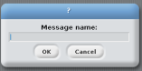
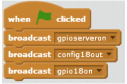

# Turning an LED on (Scratch 1.4)

Within this tutorial we are going to make an LED turn on using scratch and a Raspberry Pi.

## Equipment You Will Need
* 1 x red LED
* 2 x male to female jumper wires
* 1 x breadboard
* 1 x 330 ohm resistor
* Raspberry Pi
* keyboard
* Mouse
* SD Card with Raspbian installed
* HDMI cable
* Compatible Screen
* Power Supply

## The Circuit

## Code
The first thing we need to do is load scratch. To do this go to menu -> programming -> scratch.

1. Once Scratch has opened click on the 

2. Drag a  block to the coding area.

3. Next we need a  block. Connect it to the  block.

4. Now click on the little black arrow and click the next/edit button. You should get a text box like this . In the textbox type *gpioserveron* and click OK.

5. Drag another  block into the coding area and attach it to the  block. Click on the black arrow and click on new/edit. This time type *config18out* and click OK.

6. We need another  block this time attach it to  block. Again click on the black arrow and edit/new. This time type *gpio18on*.

Your code should look like this 

## What The Code Does
*  This tells Scratch to run the code when the green flag is clicked.

*  This tells Scratch to interact with the GPIO pins on the pi.

*  This configures pin 18 on the raspberry pi as an output.

*  This tells the raspberry pi to turn GPIO pin 18 on, which is where your LED is attached.

## Running The Code
Now that we have finished the code to run it click . You should now see the LED turn on, if you don't go back and see where you went wrong.

### Keep Having FUN while LEARNING!
