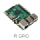
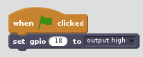

# Turning an LED on (Scratch 2)

Within this tutorial we are going to make an LED turn on using scratch and a Raspberry Pi.

## Equipment You Will Need
* 1 x red LED
* 2 x male to female jumper wires
* 1 x breadboard
* 1 x 330 ohm resistor
* Raspberry Pi
* keyboard
* Mouse
* SD Card with Raspbian installed
* HDMI cable
* Compatible Screen
* Power Supply

## The Circuit

## Code
The first thing we need to do is load scratch. To do this go to menu -> programming -> scratch.

1. Once Scratch has opened click on the  menu and drag a  block into the coding area.

2. Next click on the  menu.

3. Next click on  and double click on  Icon. This will enable the Raspberry Pi GPIO pin extension.

4. Next drag a  block into the coding area and attach it to  block.

5. Now click in the circle and type 18 (this is the GPIO pin we are using on the Pi).

Your code should now look like this 

## What The Code Does
*  This tells Scratch to run the code when the green flag is clicked.

*  This tells the raspberry pi to turn GPIO pin 18 on, which is where your LED is attached.

## Running The Code
Now that we have finished the code to run it click . You should now see the LED turn on, if you don't go back and see where you went wrong.

### Keep Having FUN while LEARNING!
